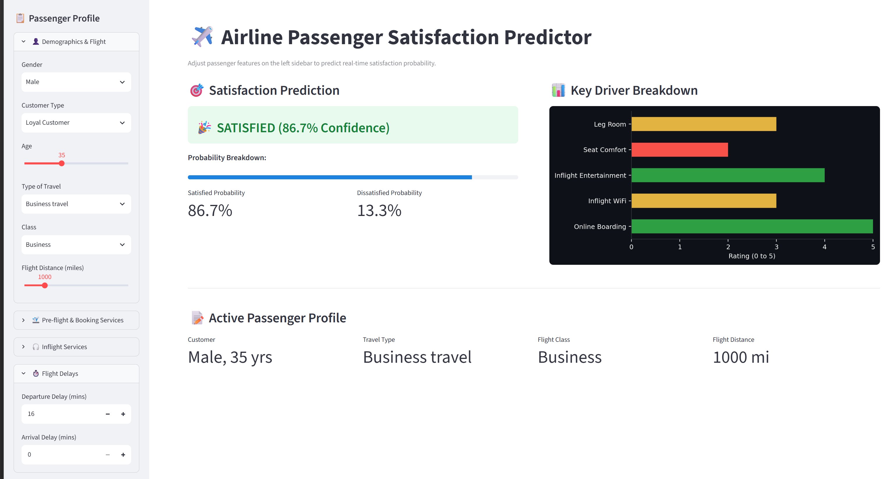

# airline-passenger-satisfaction

# ✈️ Airline Passenger Satisfaction Prediction

This project builds an end-to-end Machine Learning pipeline to predict airline passenger satisfaction (`Satisfied` vs. `Neutral or Dissatisfied`) based on demographic data, flight details, and service ratings.

It evaluates and compares two distinct machine learning architectures: a single **Decision Tree Classifier** (baseline) and a **Random Forest Classifier** (ensemble). Both models identify **Online Boarding** and **Inflight WiFi Service** as the top drivers of customer satisfaction.

---

## 🖥️ Interactive Web Dashboard

<p align="center">
  
</p>

---

## 📊 Model Comparison & Overview

Both models were tuned using 5-fold Stratified Cross-Validation and evaluated on the unseen final test set:

* **Decision Tree Baseline:** Fast and highly interpretable, but pruned (`max_depth=15`, `min_samples_split=20`) to control initial severe overfitting.
* **Random Forest Ensemble:** Outperforms the single tree across all evaluation metrics by combining 200 randomized decision trees to reduce variance and boost generalization performance.

---

## 🛠️ Project Structure

```text
airline-passenger-satisfaction/
├── assets/                 # App preview images and screenshots
│   └── dashboard_preview.png
├── data/                   # Raw train and test CSV files
├── prepared_data/          # Cleaned datasets output from preprocessing
├── notebooks/              # Sequential ML experimentation notebooks
│   ├── 1_data_inspection.ipynb
│   ├── 2_data_preprocessing.ipynb
│   ├── 3_decision_tree_model.ipynb
│   └── 4_random_forest_classification.ipynb
├── checkpoints/            # Model performance logs, CV tables & metrics
├── app.py                  # Interactive Streamlit dashboard
├── requirements.txt        # Python dependencies
└── README.md


How to Run the Project
1. Environment Setup
Clone the repository, create a virtual environment, and install dependencies:

# Create virtual environment
python -m venv .venv

# Activate environment
# On Windows:
.venv\Scripts\activate
# On macOS/Linux:
source .venv/bin/activate

# Install required packages
pip install -r requirements.txt

2. Run the Machine Learning Notebooks
Execute the Jupyter notebooks in order:

notebooks/1_data_inspection.ipynb: Analyzes dataset structure, missing values, column data types, and target distributions.

notebooks/2_data_preprocessing.ipynb: Drops ID columns (Unnamed: 0, id), removes missing values, and saves train_prepared.csv and test_prepared.csv.

notebooks/3_decision_tree_model.ipynb: Trains the single Decision Tree baseline, evaluates overfitting, performs GridSearchCV hyperparameter tuning, and logs test results.

notebooks/4_random_forest_classification.ipynb: Trains the Random Forest ensemble, runs 5-fold CV, tunes parameters (n_estimators=200), evaluates final test performance, and plots feature importance.


3. Launch the Interactive Dashboard
To test passenger predictions interactively using the Streamlit web app, run this command from the project root:

Bash
streamlit run app.py